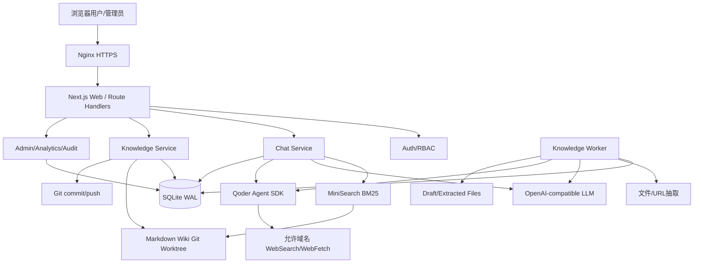
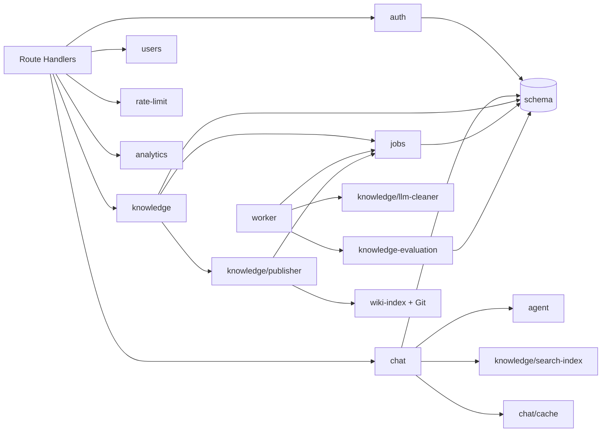
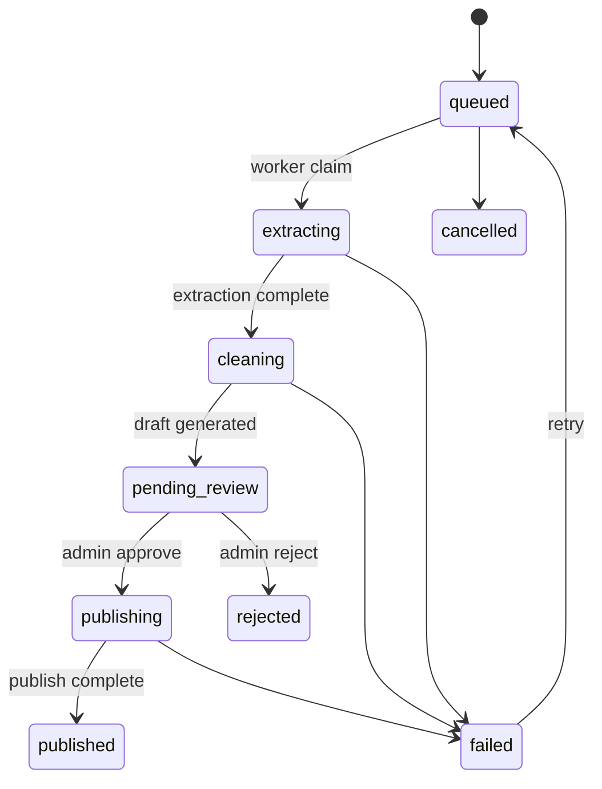

# 系统架构审计

## 1. 总体架构

这是一个共享 SQLite 与文件系统的模块化单体，运行时拆成 Web 与 worker 两个 Node.js 进程。

## 2. 分层与依赖方向

理想主路径为 `Route → Service → Repository → SQLite/Filesystem`。实际总体遵守这个方向，但存在以下穿透：

- `chat/service.ts` 直接写 `usage_events`，没有复用 analytics repository。
- `publisher.ts` 同时管理状态机、文件原子替换、索引、DB、审计和 Git，承担过多一致性职责。
- `worker/processors/knowledge.ts` 同时负责抽取、模型选择、文件写入、状态变更、版本链和评估。
- 服务/仓储均以同步 SQLite API 为主，却大量声明为 `async`，容易掩盖事务边界。
- `env` 一部分走 Zod 验证，一部分直接读 `process.env`，导致同类配置的默认值和验证行为不统一。

## 3. 进程与一致性边界

### Web 进程

- 管理 HTTP/SSE、短事务、聊天模型调用、知识审核/发布。
- `activeQueries` 是进程内 Map；停止生成只对当前 Web 进程有效。PM2 当前只有 1 实例，因此暂时可用，但不支持横向扩容或重启恢复。
- L1 缓存同样仅进程内，L2 SQLite 作为共享持久层。

### Worker 进程

- `LeaseLoop` 每次只 claim 一个 job 并等待处理完成。
- 配置虽有 `KNOWLEDGE_WORKER_CONCURRENCY`，循环没有并发调度实现，因此该配置当前无效。
- 心跳固定 30 秒，租约默认 300 秒；完成处理后停止心跳，但没有清除 lease 字段。

### SQLite

- WAL、foreign keys、5 秒 busy timeout、NORMAL synchronous。
- Web 和 worker 各自持有一个 better-sqlite3 单例连接。
- 多步跨 DB/文件/Git 操作无法获得真正的单一事务；需要显式补偿和幂等设计。

## 4. 核心模块关系

`rate-limit` 目前只被管理 API 和单元测试引用，聊天/诊断/上传入口均未调用 `checkRateLimit`，所以它是“实现存在但工作流未接线”的孤立模块。

## 5. Chat 子系统

- 主编排：`src/modules/chat/service.ts`。
- 双后端：
  - `llm-direct`：BM25 → evidence 拼入 system prompt → OpenAI-compatible stream。
  - `qoder-sdk`：Qoder 主 Agent + wiki-search/web-research 子 Agent。
- 状态：用户消息 complete；助手消息 pending → streaming → complete/interrupted/failed。
- 缓存：答案 key 使用问题 + 最近 3 个消息 ID；检索 key 使用 `retrieval:` 前缀。
- 引用：direct 路径来自本地搜索；SDK 路径期望从 tool result 抽取。

评价：主流程可读性尚可，但单文件超过 1,000 行，缓存、模型、事件解析、持久化、计费和错误处理耦合。附件、限流、停止所有权等跨模块不变量没有集中入口守卫。

## 6. Knowledge 子系统

该状态机定义清晰，但实现有三个边界问题：

1. lease 生命周期和业务状态生命周期混合，恢复查询包含了已经离开 worker 阶段的状态。
2. `maxAttempts` 是数据字段而非真实约束。
3. 发布跨文件、DB、Git，没有 outbox/操作日志；失败补偿只能恢复部分状态。

## 7. 安全边界

- 正面：JWT/Refresh Token 分离、Refresh Token 重放家族撤销、SQLite 外键、URL 初步 SSRF 校验、API RBAC 覆盖较完整、模型工具有显式禁用表。
- 风险：LLM/知识内容被带入 system prompt、Markdown 链接协议未过滤、Git 命令使用 shell 拼接、诊断接口可触发昂贵模型调用、Qoder hook allowlist 实现与工具输入类型不匹配。

## 8. 可观测性与可维护性

- SSE 暴露细粒度 timing/usage/workflow，管理后台有用量统计，这是明显优点。
- 关键 cache/usage/audit 写入大量吞错，生产上难以区分“主流程成功但审计/统计丢失”。
- 没有统一 request context / structured logger / metrics exporter。
- `SSEEventMapper` 与 `chat/service.ts` 内部又各自解析 SDK 消息，存在双实现漂移；实际主流程没有使用 mapper。
- `approveDraft` 是遗留简化发布实现，生产路由使用 `publishDraftReview`，但旧函数仍有大量单测，会稀释对真实发布路径的测试投入。

## 9. 总体架构判断

当前架构适合单机 MVP，模块命名和业务边界较清晰，但可靠性主要依赖“单进程、低并发、人工审核”。要成为稳定生产系统，优先级不是全面微服务化，而是：修复跨边界不变量、收紧命令/模型安全、把状态机与租约分离、为发布引入可恢复操作日志，并把真实生产路径纳入集成测试。
