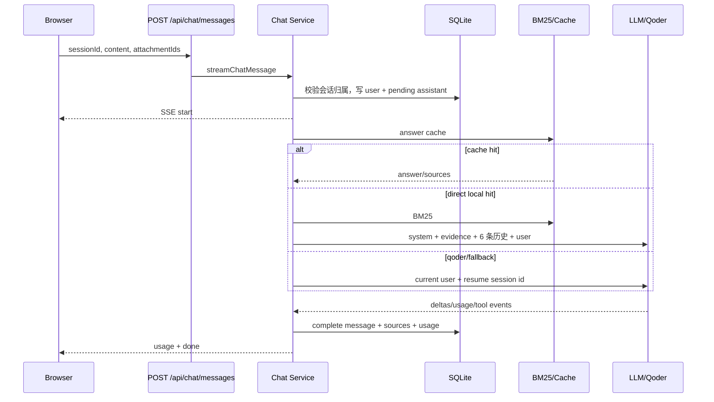

# 端到端工作流

## WF-1 认证与授权

1. 注册：校验 username/password/reason → bcrypt → `users.pending`。
2. 管理员审批后用户变为 active。
3. 登录：校验密码与状态 → 30 分钟 HS256 access token + 7 天随机 refresh token。
4. API 从 `Authorization: Bearer` 读取 access token；多数业务再调用 active/role 守卫。
5. refresh：轮换 token，旧 token 标为 revoked/replaced；重放时撤销 family。
6. 状态修改接口一般校验 Origin/Host。

失败/风险路径：access token 内嵌 role/status，禁用/降权后旧 token 在最多 30 分钟内仍沿用旧权限；刷新时才重新读数据库。用户删除逻辑与外键模型不一致，见 F-10。

## WF-2 聊天发送与流式回答

关键分支：

- 默认 direct 只有在 BM25 有结果、top score 达阈值且 LLM 配置完整时才走 30 秒直连。
- 无本地命中或直连未配置会进入 Qoder 60 秒 fallback。
- 明确配置 `qoder-sdk` 时使用配置的聊天超时（默认 120 秒）。
- 超时且已有部分 direct 文本时把部分文本标为 complete；SDK abort 则标 interrupted。
- 首个完成回答的前 30 个字符成为会话标题。

问题：限流完全未执行；附件不绑定/不进入模型；SDK evidence 解析协议错位；direct evidence 被提升到 system 权限；错误文本可能直接返回给前端。

## WF-3 停止、重试与反馈

- stop：根据 message ID 查 `activeQueries` 并 abort。
- retry：找到原助手消息与前一条用户消息，再调用完整发送流程。
- feedback：按 `(message_id,user_id)` upsert 或删除。

问题：stop 的 `userId` 参数未使用，调用者所有权没有验证。retry 会新增一条重复 user message，而注释宣称只创建新的 assistant reply；`reply_to_message_id` 也没有在普通发送中设置，模型/展示语义与规范不一致。

## WF-4 知识来源到候选稿

1. knowledge_admin/admin 上传文件或提交 HTTPS URL。
2. 服务计算 hash、查重、创建 source 与 queued job。
3. worker claim：queued → extracting，并设置 lease。
4. 文件按 MIME 抽取；URL 经 SSRF/redirect/size 校验后 Readability 抽取。
5. 抽取文本缓存到 `DATA_ROOT/extracted/<source-id>.txt`。
6. extracting → cleaning。
7. 从 `system_settings` 读取清洗后端：LongCat-compatible direct 或 Qoder SDK。
8. 解析/校验 Front Matter，限制总字符 5,000，写 draft 文件。
9. cleaning → pending_review；创建版本化 draft，旧 draft superseded。
10. 自动运行 6 个非 LLM 维度评估。

问题：进入 pending_review 时未清理租约，5 分钟后恢复器会把它重新排队；Qoder 清洗没有可靠的 generator 关闭/abort 传播；URL 下载体的超时在收到响应头后已被清除。

## WF-5 反馈、重洗、评估

- 管理员可提交维度评分、评论和改进要求。
- re-clean 合并所有未应用反馈为 JSON 字符串，创建新 job，并把反馈标记为已应用。
- worker 把该 JSON 原样追加到模型 user prompt；生成 parentDraftId/version 链。
- `deep=true` 路由被接受并持久化，但 LLM accuracy/completeness/clarity 尚未实现；结果仍只有 6 维且状态为 `heuristic_done`。

风险：反馈在成功创建新 draft 前就标记 applied；若 job 永久失败，反馈不会自动回滚为待应用。清洗提示词把原始网页/文档和反馈当作指令上下文，缺少对嵌入式 prompt injection 的明确隔离。

## WF-6 审核与发布

1. admin/knowledge_admin 编辑候选稿并批准。
2. CAS pending_review → publishing。
3. 写 `.tmp`、fsync、解析、备份旧文件、原子 rename。
4. 重建 Wiki `index.md`。
5. 创建/更新 item、批准 draft、job → published、写审计日志。
6. `git add`、`git commit`；如配置 remote，detached async push。
7. 更新 `wiki_sync_status`。

问题：步骤 5 并没有被一个 DB transaction 包住；步骤 6 使用 shell 字符串拼接；异步 push 立刻写不存在的 `pushed` 状态；后置失败的补偿试图回滚已经 published 的 job，CAS 必然失败，并可能出现 DB/Git/文件不一致。

## WF-7 任务租约与恢复

- loop 每 5 秒轮询；每 5 tick 恢复过期租约。
- claim 使用 select + CAS update；SQLite 单写者语义使并发 claim 基本安全。
- 心跳每 30 秒延长租约。
- 当前实现每轮等待 job 完成，因此 worker concurrency 配置无效。
- recover 把 `extracting/cleaning/pending_review/publishing` 的过期租约全部改回 queued。

正确的恢复边界应仅覆盖由 worker 拥有的执行状态（extracting/cleaning），并验证 lease owner/attempt；人工审核和 Web 发布状态需要独立恢复策略。

## WF-8 部署与恢复

文档流程：备份 → pull → migration dry-run → build → 停进程 → migration → 起进程 → readiness/smoke。

实际 `deploy.sh`：pull → npm ci → build →复制 standalone 资产 →直接 migrate → PM2 restart。它没有调用备份/校验脚本，也没有 readiness rollback。`pre-deploy-migrate.sh` 另有安全机制，但默认 DB 路径与正式路径不一致，且没有被 deploy.sh 编排。
